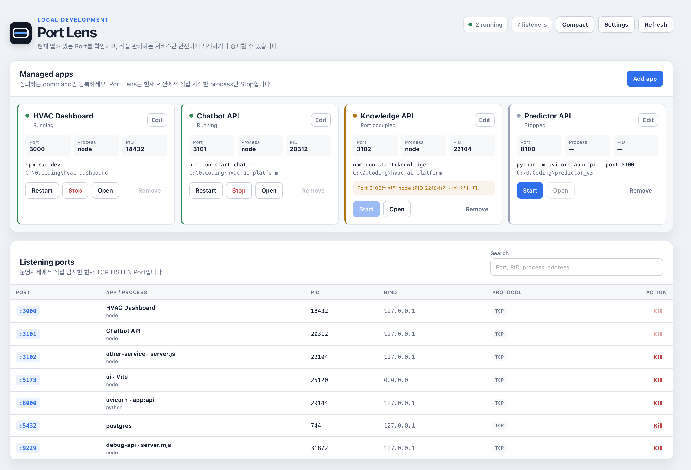
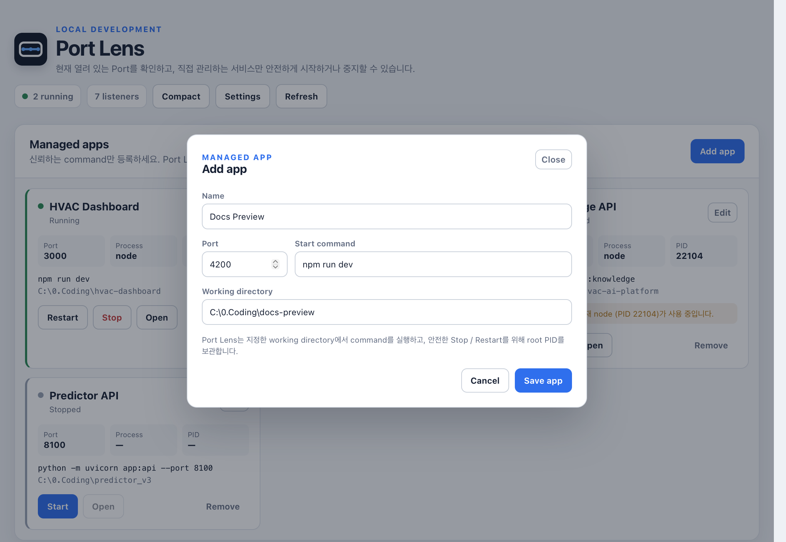
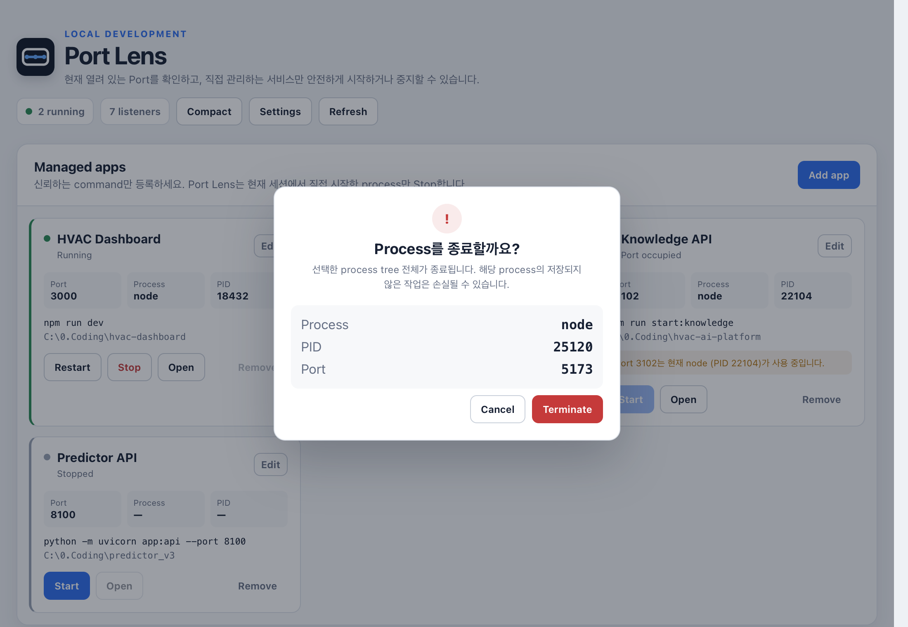
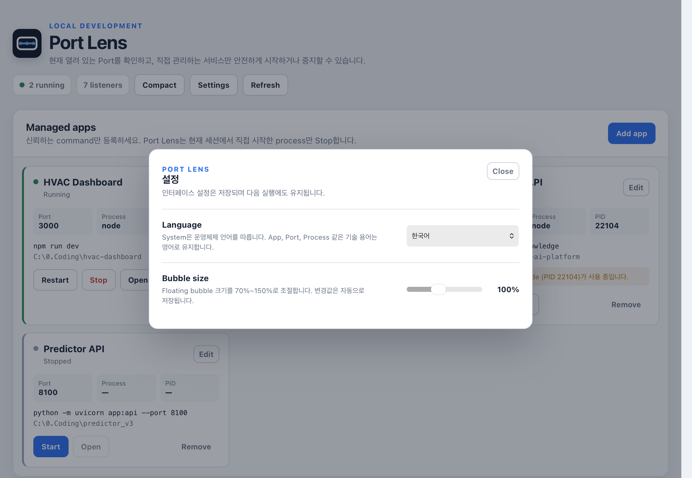

<div align="center">
  
  <h1>Port Lens</h1>
</div>

<p align="center">
  <a href="README.md">English</a> · <strong>한국어</strong>
</p>

<p align="center">
  <em>내 PC에서 실행 중인 Port와 local development service를 가볍게 확인하고 제어하는 desktop tool.</em>
</p>

<p align="center">
  <a href="https://tauri.app/"></a>
  <a href="https://www.rust-lang.org/"></a>
  
  
</p>

<div align="center">
  
</div>
Port Lens는 **지금 이 Port를 어떤 process가 사용하고 있고, 그 process가 내가 관리하는 App인지**를 빠르게 확인하기 위한 tool입니다. 운영체제에서 TCP listener를 직접 탐지하고 process에 연결하며, 명시적으로 등록한 개발 service에는 안전한 Start / Stop / Restart 제어를 제공합니다.

주 runtime target은 **Windows 11**입니다. macOS listener 탐지도 개발과 검증을 위해 지원합니다.

---

## ✨ 주요 기능

- **실시간 Port 탐지** — Windows/macOS에서 TCP LISTEN endpoint를 직접 조회합니다.
- **Friendly App identity** — 등록 App 이름을 우선 표시하고, 미등록 listener는 command line에서 보수적으로 실행 힌트를 추론합니다. 실제 process 이름과 PID는 그대로 유지합니다.
- **Managed App 제어** — 신뢰하는 command, working directory, Port를 등록해 Start / Stop / Restart합니다.
- **Port 충돌 표시** — 지정 Port가 이미 사용 중이면 blocker를 임의 종료하지 않고 충돌 상태를 표시합니다.
- **안전한 unmanaged 종료** — Kill 전 명시적 확인을 받고, 실제 종료 직전에 PID + Port 소유 관계를 다시 검사합니다.
- **Compact bubble** — `running apps / listening ports`를 always-on-top bubble로 표시하고 70%~150% 크기를 선택할 수 있습니다.
- **Language 설정** — System / English / 한국어를 지원하며 App, Port, Process 같은 기술 label은 영어로 유지합니다.
- **Native tray** — dashboard 열기, bubble 표시, Refresh, Quit을 system tray에서 수행합니다.
- **Windows Portable** — 설치 없이 single EXE로 실행할 수 있습니다.
- **Responsive dashboard** — 창을 최대화하면 고정 폭에 갇히지 않고 사용 가능한 desktop 공간을 활용합니다.

---
## Showcase

<table>
<tr>
<td width="34%" align="center"><br><sub>Managed App — 신뢰하는 command, working directory, Port 등록</sub></td>
<td width="34%" align="center"><br><sub>Terminate — unmanaged listener 종료 전 명시적 확인</sub></td>
<td width="32%" align="center"><br><sub>Compact Bubble — 실행 중인 Managed App과 listening Port를 한눈에 확인</sub></td>
</tr>
<tr>
<td colspan="3" align="center"><br><sub>Settings — System / English / 한국어와 70%~150% Bubble size 설정</sub></td>
</tr>
</table>

<sub>Showcase 이미지는 실제 Port Lens frontend를 synthetic mock data로 렌더링한 결과입니다. Mock fixture는 local-only이며 패키지에 포함되지 않습니다.</sub>

---

## 🚀 Windows에서 시작하기

Windows x64 preview build는 [GitHub Releases](https://github.com/teeeeooo/port-lens/releases)에서 제공합니다. `windows-latest` GitHub Actions runner가 NSIS, MSI, single-EXE Portable을 생성합니다.
| Package | 파일명 패턴 | 설명 |
| :--- | :--- | :--- |
| **NSIS** | `Port.Lens_<version>_x64-setup.exe` | 일반 Windows setup executable |
| **MSI** | `Port.Lens_<version>_x64_en-US.msi` | Windows Installer package |
| **Portable** | `Port.Lens_<version>_x64-portable.exe` | 설치 없이 실행하는 single EXE. 설정은 일반 사용자 App config 경로에 저장됩니다. |
| **Checksums** | `SHA256SUMS.txt` | Release artifact의 SHA-256 hash |

### Windows SmartScreen

현재 preview installer와 Portable EXE는 **code signing이 적용되지 않았습니다**. 따라서 Windows SmartScreen, WDAC/AppLocker, EDR 또는 회사 보안 정책에서 경고하거나 실행을 차단할 수 있습니다. 관리 PC의 보안 정책을 우회하지 말고 해당 정책에 따라 사용하세요.

---

## App 식별 방식

Port Lens는 화면에 표시하는 이름과 운영체제의 실제 process identity를 분리합니다. 실행 중인 listener가 Managed App에 속하면 `Chatbot API` 같은 등록 이름을 우선 표시하고, 그 아래에는 실제 executable인 `node`를 그대로 남깁니다.

미등록 listener는 command line에서 `ui · Vite`, `uvicorn · app:api`, `debug-api · server.mjs` 같은 보수적인 label을 만들 수 있습니다. 식별 가능한 정보가 없으면 실제 process 이름으로 fallback합니다. 추론 label은 process 제어에 사용하는 PID나 executable identity를 대체하지 않습니다.

---
## 🔒 Safety Model

Port Lens는 **Managed App**과 단순히 특정 Port를 사용 중인 임의의 process를 의도적으로 구분합니다.

1. Managed App은 사용자가 command, working directory, preferred Port를 등록한 뒤에만 Start / Stop / Restart 제어를 받습니다.
2. Port Lens가 App을 Start하면 root PID를 기록하고 그 runtime ownership을 Managed Stop / Restart에 사용합니다.
3. preferred Port가 이미 사용 중이면 충돌을 표시하며 blocker를 자동 종료하지 않습니다.
4. unmanaged listener는 별도의 **Kill** action과 명시적 confirmation dialog를 사용합니다.
5. Kill 직전에 listener를 다시 조회해 동일 PID가 동일 Port를 계속 소유하는지 확인합니다.
6. 보호 PID 또는 실행 중인 Managed App에 연결된 listener는 unmanaged kill path에서 거부합니다.

이 정책은 busy Port를 자동으로 점유하는 방식보다 의도적으로 보수적입니다.

---

## Language / Bubble / Tray

Settings에서 **System / English / 한국어**를 선택할 수 있습니다. System은 운영체제 언어를 따르며, 한국어 모드에서도 App, Port, Process, PID, Start / Stop / Restart 같은 기술·조작 label은 영어를 유지합니다. 설명, 경고, 확인 문구를 중심으로 한국어가 적용됩니다.

Compact Bubble은 **70%~150%, 10% step**으로 크기를 조절할 수 있고 Language 설정과 함께 저장됩니다. Bubble을 다시 열어도 선택한 크기를 유지하며, full window로 복원하면 이전 size, position, maximized 상태를 되돌립니다.

Native tray에는 **Open Port Lens**, **Show compact bubble**, **Refresh now**, **Quit Port Lens**가 있습니다. main window를 닫으면 app이 종료되지 않고 tray로 숨겨지며, 명시적으로 Quit해야 종료됩니다.

---
## 🛠️ Development

필요 환경:

- Node.js 22+
- npm
- Rust stable toolchain
- host OS용 Tauri 2 desktop prerequisite

```bash
git clone https://github.com/teeeeooo/port-lens.git
cd port-lens
npm ci
npm run tauri dev
```

기본 검증:

```bash
npm run build
cargo fmt --manifest-path src-tauri/Cargo.toml -- --check
cargo clippy --manifest-path src-tauri/Cargo.toml --all-targets --all-features -- -D warnings
cargo test --manifest-path src-tauri/Cargo.toml
```

GitHub CI는 macOS와 Windows에서 frontend build, rustfmt, warning 0 기준 Clippy, Rust test를 수행합니다. 별도 Windows Bundle workflow는 native Tauri release build로 NSIS, MSI, Portable EXE를 생성합니다.
### Local mock screenshot

README screenshot은 실제 frontend를 사용하되, development 전용 fixture 경로를 제품 runtime과 분리합니다.

```text
dev-mock/port-lens.json     # gitignore
.local-screenshots/         # gitignore
        │
        └─ Vite dev-only /__port-lens-mock
                    │
                    └─ 명시적 ?mock=1 opt-in
```

`dev-mock/`은 Vite development mode에서만 제공되고 frontend도 `import.meta.env.DEV`와 `?mock=1`이 모두 성립할 때만 요청합니다. 일반 `tauri dev`와 production build는 Tauri IPC를 통해 실제 OS data만 사용합니다.

Screenshot state에는 dashboard, App editor, terminate dialog, 한국어 Settings, 다양한 Bubble size가 포함됩니다. `scripts/capture-webkit.swift`를 사용해 macOS Screen Recording 권한 없이 PNG를 생성합니다.

`.github/assets/*.png`에는 문서용 렌더링 결과만 commit하며 synthetic fixture 자체는 commit하거나 package하지 않습니다.

---

## Architecture

```text
React / TypeScript UI
        │ Tauri commands + events
        ▼
Rust backend
 ├─ ports.rs            listener discovery + command-line metadata
 ├─ process_control.rs  spawn / stop / terminate process trees
 ├─ registry.rs         persisted Managed App configuration
 ├─ settings.rs         language + bubble-size preferences
 ├─ bubble.rs           compact native-window lifecycle
 └─ lib.rs              commands, tray, events, window lifecycle
```
### Platform discovery

**Windows**에서는 `Get-NetTCPConnection -State Listen`, `Get-Process`, read-only `Win32_Process` command-line metadata를 사용합니다. PowerShell 결과를 structured JSON으로 변환하므로 localized `netstat` 문자열에 의존하지 않으며 PowerShell window도 표시하지 않습니다.

**macOS**에서는 `lsof -nP -iTCP -sTCP:LISTEN -Fpcn`과 `ps`를 사용합니다. macOS 지원의 주 목적은 target Windows PC가 아닌 환경에서도 개발과 UI 검증을 계속할 수 있게 하는 것입니다.

---

## Design References

Port Lens는 독립 구현이며 다음 프로젝트에서 interaction/architecture 아이디어를 참고했습니다.

- **Microsoft TCPView / Sysinternals** — endpoint와 process의 직접적인 연결 표시
- **System Informer** — process inspection과 process control의 명확한 분리
- **PortPilot** — Managed service + active Port workflow
- **PortManager** — 밀도 높은 Port/process 표시와 명시적인 종료 확인
- **Token Lens** — Tauri desktop lifecycle, native tray, optional floating bubble 및 Bubble size pattern

위 프로젝트의 source code를 Port Lens에 복사하지 않았으며 제품 interaction과 architecture reference로만 사용했습니다.

---

## 현재 범위

TCP listener, Managed App, 안전한 process 제어, friendly App identification, responsive UI, tray, 크기 조절 가능한 Compact Bubble, English/한국어 preference, Windows installer/Portable packaging이 구현되어 있습니다. UDP 탐지, HTTP health check, 외부에서 시작된 server의 안전한 adoption은 향후 범위입니다.
