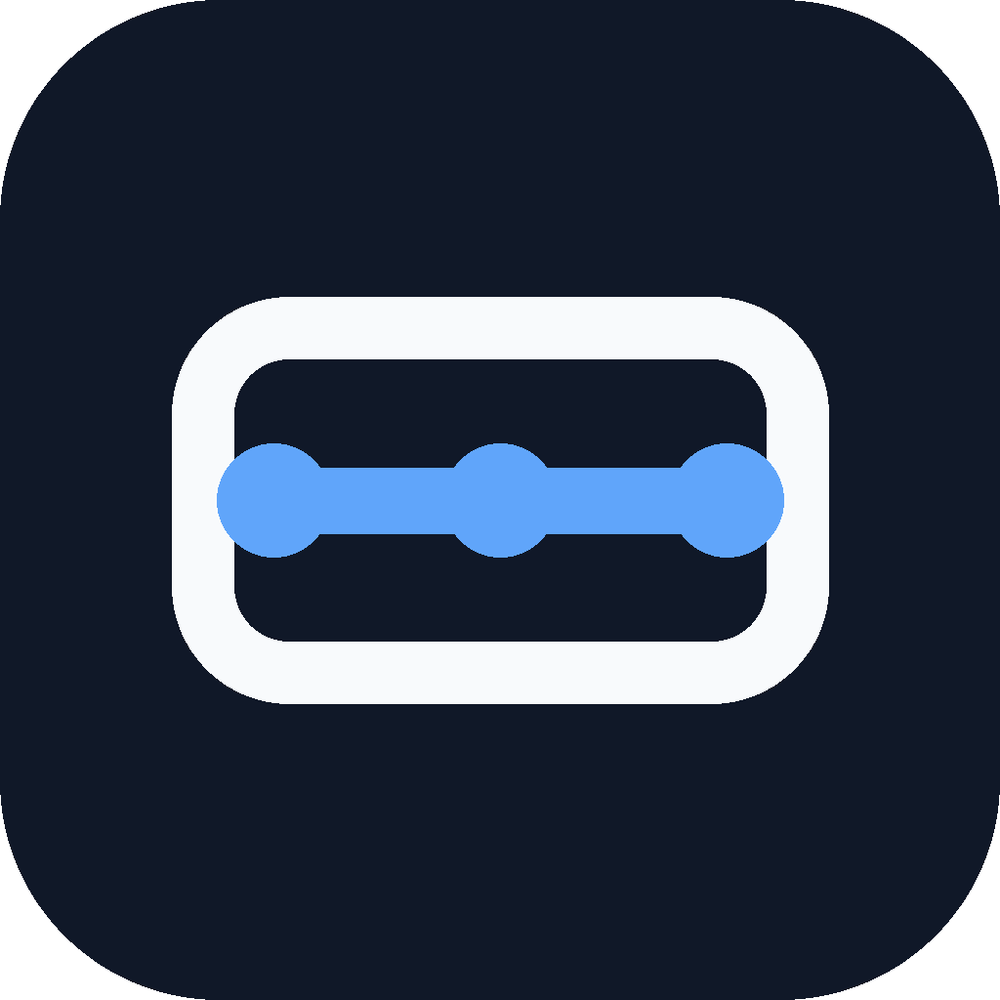
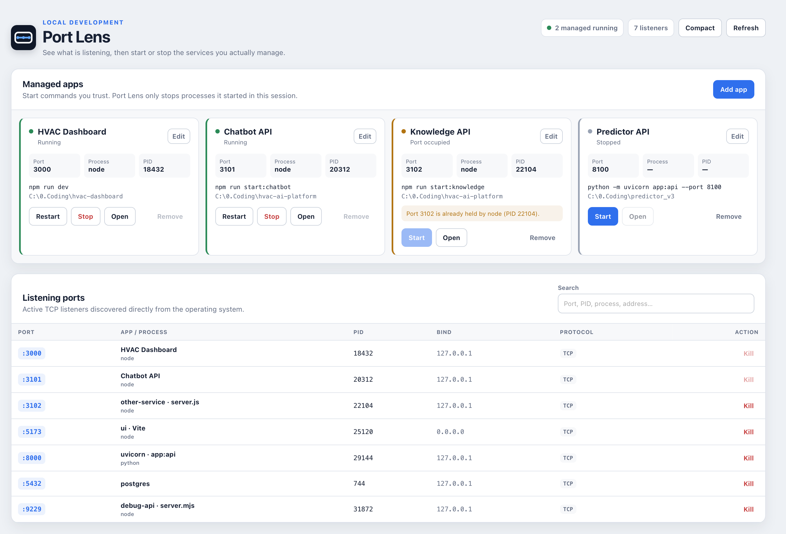
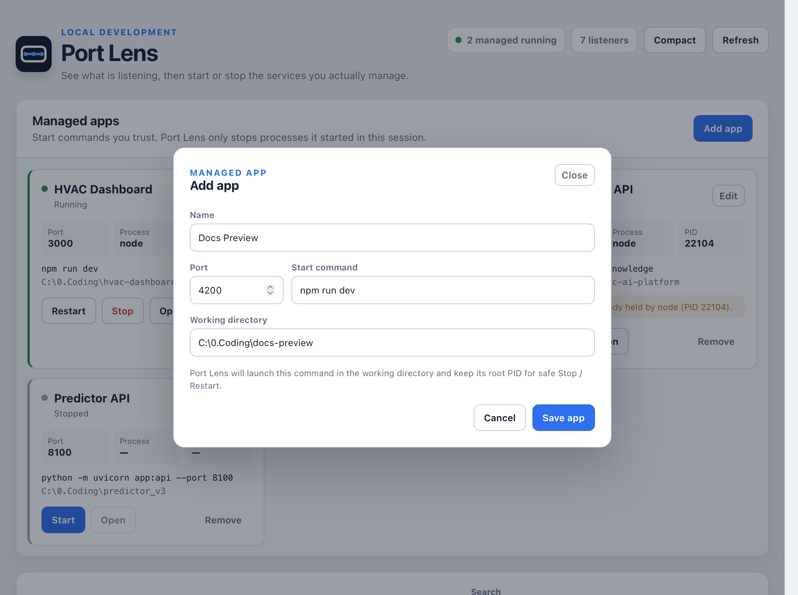
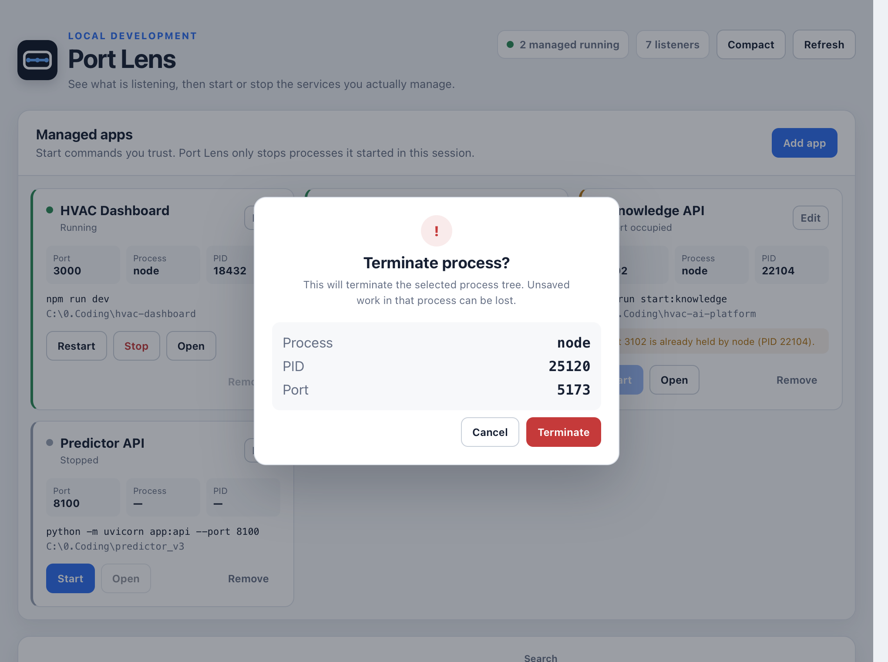
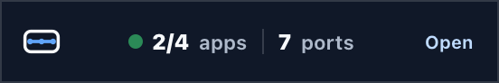

<div align="center">
  
  <h1>Port Lens</h1>
</div>

<p align="center">
  <em>A lightweight desktop lens for the ports and local development services running on your machine.</em>
</p>

<p align="center">
  <a href="https://tauri.app/"></a>
  <a href="https://www.rust-lang.org/"></a>
  
  
</p>

<div align="center">
  
</div>

Port Lens answers a simple local-development question: **what is using this port, and is it one of my apps?** It discovers TCP listeners from the operating system, maps them to processes, and gives explicitly registered development services safe Start / Stop / Restart controls.

The primary runtime target is **Windows 11**. macOS listener discovery is also implemented for development and validation.

---

## ✨ Key Features

- **Live port discovery** — enumerate active TCP LISTEN endpoints directly from Windows or macOS.
- **Friendly app identity** — show a registered app name first; otherwise derive a conservative runtime hint from the process command line while retaining the real executable name and PID.
- **Managed app controls** — register a trusted command, working directory, and preferred port for one-click Start / Stop / Restart.
- **Conflict visibility** — refuse to start a managed app when another process already owns its port instead of silently killing the blocker.
- **Safe unmanaged termination** — confirm before terminating an unknown listener and re-check the selected PID + port immediately before the kill.
- **Compact bubble** — collapse the dashboard into an always-on-top `running apps / listening ports` monitor and restore it with one click.
- **Native system tray** — reopen the dashboard, show the compact bubble, refresh, or quit without keeping the main window in front.
- **Responsive dashboard** — use the available desktop width instead of keeping a fixed narrow content column when maximized.

---

## Showcase

<table>
<tr>
<td width="34%" align="center"><br><sub>Managed App — register a trusted command, working directory, and preferred port</sub></td>
<td width="34%" align="center"><br><sub>Terminate — explicit confirmation before stopping an unmanaged listener</sub></td>
<td width="32%" align="center"><br><sub>Compact Bubble — running managed apps and total listening ports at a glance</sub></td>
</tr>
</table>

<sub>Showcase images use synthetic mock data rendered by the real Port Lens frontend on macOS. Mock fixtures are local-only and are not part of the packaged application.</sub>

---

## 🚀 Getting Started on Windows

Unsigned Windows x64 preview installers are published through [GitHub Releases](https://github.com/teeeeooo/port-lens/releases). Port Lens currently produces both installer formats on a native `windows-latest` GitHub Actions runner.

| Package | Pattern | Description |
| :--- | :--- | :--- |
| **NSIS** | `Port.Lens_<version>_x64-setup.exe` | Standard Windows setup executable. |
| **MSI** | `Port.Lens_<version>_x64_en-US.msi` | Windows Installer package. |
| **Checksums** | `SHA256SUMS.txt` | SHA-256 hashes for release artifacts. |

### Windows SmartScreen

Preview installers are currently **unsigned**. Windows SmartScreen, WDAC/AppLocker, EDR, or organization policy may therefore warn about or block them. Follow the policy of the machine where Port Lens is being installed rather than bypassing managed-device controls.

---

## App identification

Port Lens keeps display names and operating-system identity separate. A listener owned by a running Managed App is shown with the configured app name, such as `Chatbot API`, with `node` retained underneath as the actual process executable.

For unregistered listeners, Port Lens may derive a conservative label from the process command line, for example `ui · Vite`, `uvicorn · app:api`, or `debug-api · server.mjs`. When no useful hint is available, it falls back to the real process name. The inferred label never replaces the PID or underlying executable identity used for process control.

---

## 🔒 Safety Model

Port Lens deliberately distinguishes a **Managed App** from an arbitrary process that happens to own a port.

1. A Managed App receives Start / Stop / Restart controls only after the user registers its command, working directory, and preferred port.
2. Port Lens records the root PID when it starts that app and uses that runtime ownership for managed Stop / Restart.
3. If the preferred port is already occupied, Port Lens reports the conflict and does not automatically terminate the blocker.
4. An unmanaged listener has a separate **Kill** action with an explicit confirmation dialog.
5. Immediately before an unmanaged kill, Port Lens re-enumerates listeners and verifies that the same PID still owns the selected port.
6. Protected process IDs and listeners assigned to an actively managed app are rejected by the unmanaged termination path.

This is intentionally more conservative than automatically taking ownership of a busy development port.

---

## Compact Bubble & Tray

The dashboard can collapse into a small always-on-top bubble showing `running managed apps / total managed apps` and the current number of listening ports. Expanding restores the previous window size, position, and maximized state.

The native tray provides **Open Port Lens**, **Show compact bubble**, **Refresh now**, and **Quit Port Lens**. Closing the main window hides it to the tray rather than terminating the application; explicit Quit exits the process.

---

## 🛠️ Development

Requirements:

- Node.js 22+
- npm
- Rust stable toolchain
- Tauri 2 desktop prerequisites for the host operating system

```bash
git clone https://github.com/teeeeooo/port-lens.git
cd port-lens
npm ci
npm run tauri dev
```

Core validation:

```bash
npm run build
cargo fmt --manifest-path src-tauri/Cargo.toml -- --check
cargo clippy --manifest-path src-tauri/Cargo.toml --all-targets --all-features -- -D warnings
cargo test --manifest-path src-tauri/Cargo.toml
```

GitHub CI runs the frontend build, rustfmt, Clippy with warnings denied, and Rust tests on both macOS and Windows. A separate Windows Bundle workflow performs a native Tauri release build and uploads NSIS + MSI artifacts.

### Local mock screenshots

Documentation screenshots are rendered from the real frontend with a deliberately isolated development-only fixture path:

```text
dev-mock/port-lens.json     # ignored by git
.local-screenshots/         # ignored by git
        │
        └─ Vite dev-only /__port-lens-mock
                    │
                    └─ explicit ?mock=1 opt-in
```

`dev-mock/` is served only when Vite is running in development mode. The frontend will request it only when both `import.meta.env.DEV` and `?mock=1` are true. Normal `tauri dev` without that query and every production build continue to use Tauri IPC and real OS data.

The local screenshot states are `?mock=1` for the dashboard, `?mock=1&screen=app-editor`, `?mock=1&screen=terminate`, and `?mock=1&bubble=1`. `scripts/capture-webkit.swift` renders those states to PNG without requiring macOS Screen Recording permission.

The committed `.github/assets/*.png` files are rendered documentation outputs only; the synthetic fixture itself is not committed or packaged.

---

## Architecture

```text
React / TypeScript UI
        │ Tauri commands + events
        ▼
Rust backend
 ├─ ports.rs            listener discovery + command-line metadata
 ├─ process_control.rs  spawn / stop / terminate process trees
 ├─ registry.rs         persisted Managed App configuration
 ├─ bubble.rs           compact native-window lifecycle
 └─ lib.rs              commands, tray, events, window lifecycle
```

### Platform discovery

**Windows** uses `Get-NetTCPConnection -State Listen`, `Get-Process`, and read-only `Win32_Process` command-line metadata. PowerShell serializes structured JSON so listener parsing does not depend on localized `netstat` strings. PowerShell is launched without a visible console window.

**macOS** uses `lsof -nP -iTCP -sTCP:LISTEN -Fpcn` for listener ownership and `ps` for command-line enrichment. macOS support primarily exists to keep development and UI validation possible away from the target Windows machine.

---

## Design References

Port Lens is an independent implementation. Its initial product direction was informed by established or relevant tools rather than copied from them:

- **Microsoft TCPView / Sysinternals** — direct endpoint-to-process visibility.
- **System Informer** — clear separation between process inspection and process control.
- **PortPilot** — managed-service plus active-port workflow and local-development ergonomics.
- **PortManager** — dense searchable port/process presentation and explicit termination confirmation.
- **Token Lens** — compact Tauri desktop lifecycle patterns, native tray behavior, and the optional floating-bubble interaction model.

No source code from those projects is copied into Port Lens; they are interaction and architecture references.

---

## Current Scope

TCP listeners, Managed Apps, safe process control, friendly app identification, responsive desktop UI, tray residency, and compact bubble mode are implemented. UDP discovery, HTTP health checks, and safe adoption of externally started servers remain future work.
